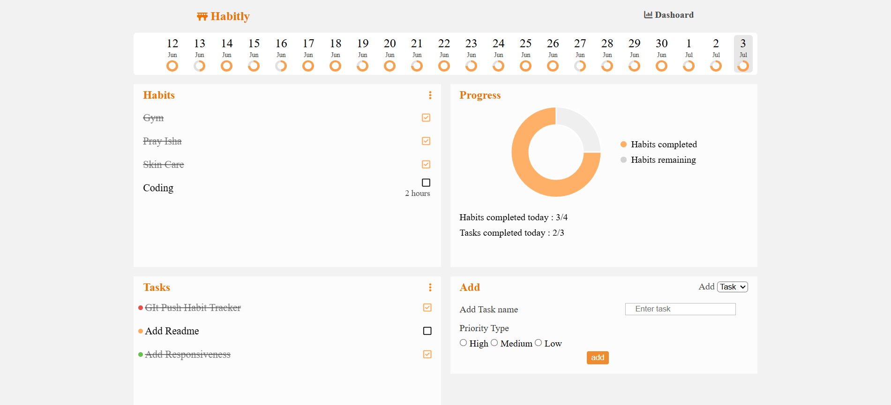
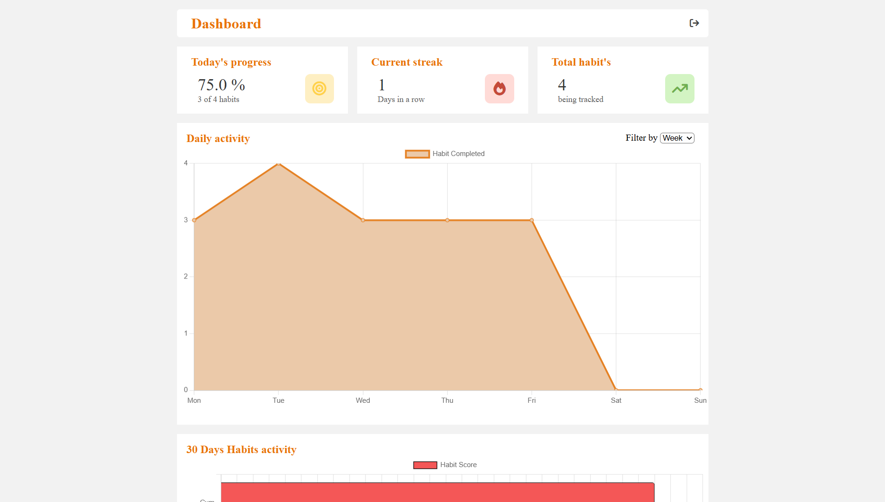

<h1>Habitly - Habit Tracker & Task Manager</h1>

Habitly is a productivity web application built using
<strong>HTML</strong>, <strong>CSS</strong>, and <strong>JavaScript</strong>.
It helps users develop consistent habits, organize daily tasks, and monitor their progress through interactive dashboards and analytics.

Live link : https://habitly-eight-delta.vercel.app/

<h2>Preview</h2>

<h2>Features</h2>

<ul>
<li>Create and manage daily habits</li>
<li>Create and manage daily tasks (To-Do List)</li>
<li>Delete habits and tasks</li>
<li>Mark habits and tasks as completed</li>
<li>Track daily habit completion</li>
<li>Interactive calendar showing daily progress</li>
<li>Daily completion percentage</li>
<li>Current streak tracking</li>
<li>Progress doughnut chart</li>
<li>Weekly activity analytics</li>
<li>Monthly activity dashboard</li>
<li>30-day performance tracking for each habit</li>
<li>Data persistence using Local Storage</li>
<li>Responsive user interface</li>
</ul>

<h2>Technologies Used</h2>

<ul>
<li>HTML5</li>
<li>CSS3</li>
<li>JavaScript (ES6)</li>
<li>Chart.js</li>
<li>Font Awesome</li>
</ul>

<h2>Concepts Practiced</h2>

<ul>
<li>DOM Manipulation</li>
<li>CRUD Operations</li>
<li>Event Handling</li>
<li>Array and Object Manipulation</li>
<li>Local Storage</li>
<li>Chart.js Integration</li>
<li>Data Visualization</li>
<li>Responsive Design</li>
<li>Application State Management</li>
</ul>

<h2>Dashboard Overview</h2>

The application includes a dedicated dashboard that provides an overview of user productivity through visual analytics and performance statistics.

<ul>
<li>Today's completion percentage</li>
<li>Current habit streak</li>
<li>Total habits being tracked</li>
<li>Weekly habit completion graph</li>
<li>Monthly habit activity chart</li>
<li>30-day completion score for each habit</li>
</ul>

<h2>How It Works</h2>

<ul>
<li>Create habits and daily tasks.</li>
<li>Mark completed habits and tasks throughout the day.</li>
<li>Track progress using the home dashboard.</li>
<li>View weekly and monthly analytics.</li>
<li>Monitor individual habit performance over the last 30 days.</li>
<li>All data is automatically saved using Local Storage.</li>
</ul>

<h2>What I Learned</h2>

<ul>
<li>Building a complete JavaScript application without frameworks</li>
<li>Managing application state using Local Storage</li>
<li>Implementing CRUD functionality</li>
<li>Working with Chart.js for analytics and reporting</li>
<li>Creating multi-page web applications</li>
<li>Handling date-based productivity tracking</li>
<li>Designing responsive dashboard interfaces</li>
<li>Writing modular and reusable JavaScript code</li>
</ul>

<h2>Future Improvements</h2>

<ul>
<li>User authentication</li>
<li>Cloud database integration</li>
<li>Recurring habit scheduling</li>
<li>Notifications and reminders</li>
<li>Dark mode</li>
<li>Habit categories and tags</li>
<li>Export reports as PDF or CSV</li>
<li>Calendar heatmap visualization</li>
<li>Drag-and-drop task organization</li>
<li>React version with backend support</li>
</ul>

<h2>Author</h2>

<strong>Areeb Baig</strong>
  
GitHub:
<a href="https://github.com/areebbaig580">
https://github.com/areebbaig580
</a>

